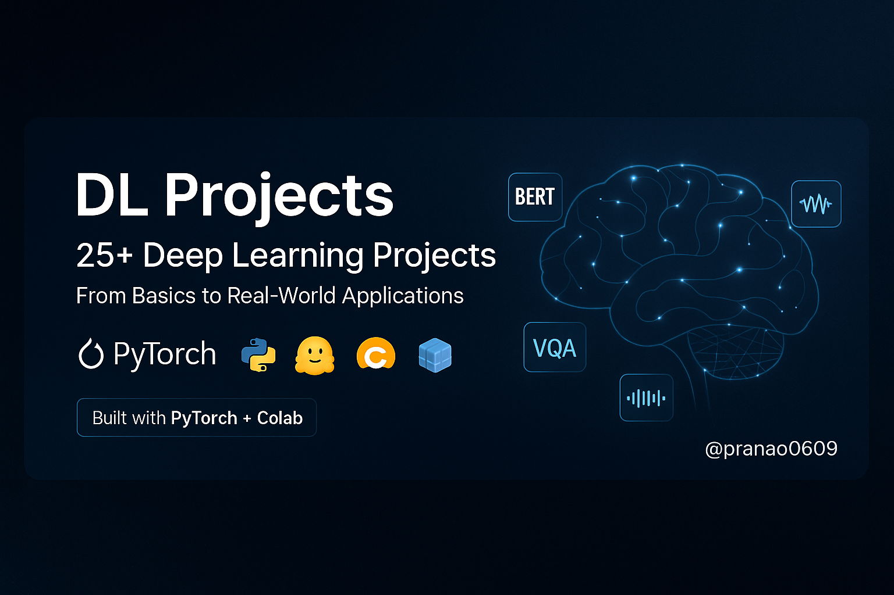

  

# DL Projects – 25 End-to-End Deep Learning Projects

Welcome to **DL Projects**, a curated collection of **25 real-world Deep Learning projects**, built using **PyTorch**, **Transformers**, and popular DL libraries — all created and tested in **Google Colab**. This repository is designed to help you master deep learning through hands-on practice, from fundamentals to state-of-the-art models in vision, NLP, and audio.

---

##  Project List

###  Beginner Projects
| #  | Project | Description |
|----|---------|-------------|
| 01 | `Linear_Regression_pytorch` | Linear regression using PyTorch |
| 02 | `MNIST_Claasifier` | Handwritten digit classification using CNN |
| 03 | `Softmax_Classifier` | Multiclass classifier using Softmax & CrossEntropy |
| 04 | `Sentiment_Classifer` | Sentiment analysis on movie reviews |
| 05 | `Image_Augentation_Pipeline` | Data augmentation techniques with torchvision |
| 06 | `Visualize_Maps_CNN` | Visualizing convolutional feature maps |
| 07 | `GRAD_CAM` | Model interpretability using Grad-CAM |

###  Intermediate Projects
| #  | Project | Description |
|----|---------|-------------|
| 08 | `Contrastive_SimCLR` | Contrastive learning with SimCLR |
| 09 | `Vision_Transformer` | Image classification using ViTs |
| 10 | `NER` | Named Entity Recognition using NLP models |
| 11 | `Character_Level_Language` | Language modeling at character level |
| 12 | `Machine_Seq2Seq` | Sequence-to-sequence machine translation |
| 13 | `Transformers_Text_Summarization` | Summarization using Transformer encoder-decoders |
| 14 | `Text_Genration` | RNN-based text generator |
| 15 | `BERT_Sentiment_Analysis` | Sentiment classification using BERT |
| 16 | `Semantics` | Semantic similarity between sentences |
| 17 | `TEXT_IMAGE` | Multimodal learning (text + image) |
| 18 | `Visual_QUESTION_BLIP` | VQA with BLIP model |
| 19 | `ZERO_SHOT_NLI` | Zero-shot inference with NLP models |

###  Advanced / Real-World Projects
| #  | Project | Description |
|----|---------|-------------|
| 20 | `STT` | Speech-to-text using pre-trained models |
| 21 | `Music_Genration` | LSTM-based music generation |
| 22 | `Spam_Detection` | Binary text classification (spam vs ham) |
| 23 | `NExt_Word_RNN` | Next word prediction using RNNs |
| 24 | `Hate_Speech_Detection` | Classifying hateful content in text |
| 25 | `Intent_Classification` | NLP-based intent recognition for chatbots |

---

## Tech Stack

- **Python**, **PyTorch**
- **Google Colab Notebooks**
- **Hugging Face Transformers**
- **Torchvision**, **Matplotlib**, **NumPy**
- **OpenCV**, **scikit-learn**
- **SpeechRecognition**, **Librosa**

---

